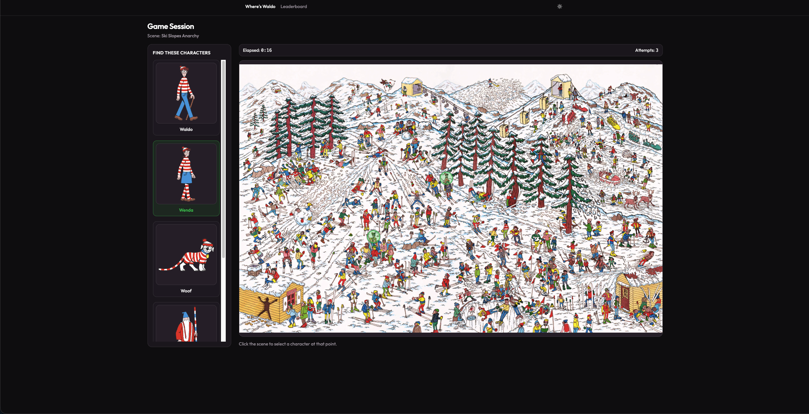

# Where's Waldo



Photo tagging game for [The Odin Project](https://www.theodinproject.com/).

[Source Repository](https://github.com/ChiefWoods/wheres-waldo)

## Features

- Find Waldo and his friends in classic scenes
- Compare your score with others in the leaderboard

## Built With

### Tech Stack

- [](https://react.dev/)
- [](https://tanstack.com/router/)
- [](https://fastify.dev/)
- [](https://www.prisma.io/)
- [](https://sqlite.org/)
- [](https://ui.shadcn.com/)
- [](https://vitest.dev)
- [](https://playwright.dev/)

## Getting Started

### Prerequisites

Update your Bun toolkit to the latest version.Respo

```sh
bun upgrade
```

### Setup

1. Clone the repository

```sh
git clone https://github.com/ChiefWoods/wheres-waldo.git
```

2. Install all dependencies

```sh
bun install
```

3. Follow the steps in [web](./apps/web/README.md) and [server](./apps/server/README.md)

## Issues

View the [open issues](https://github.com/ChiefWoods/wheres-waldo/issues) for a full list of proposed features and known bugs.

## Acknowledgements

### Resources

- [Shields.io](https://shields.io/)
- [Lucide](https://lucide.dev/)

## Contact

[chii.yuen@hotmail.com](mailto:chii.yuen@hotmail.com)
